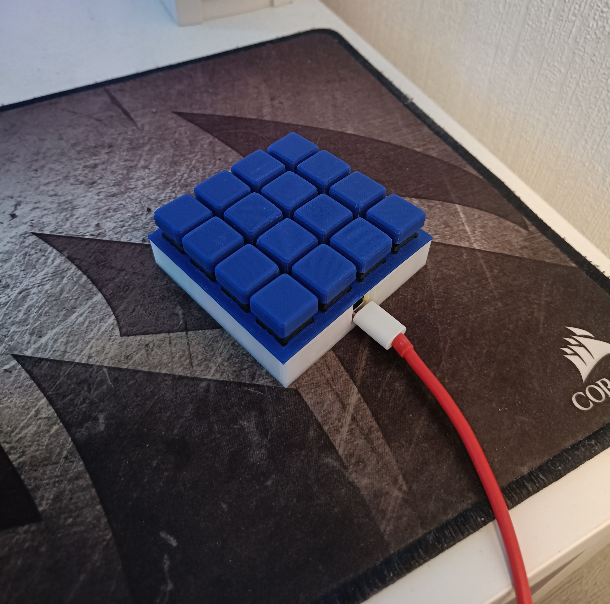
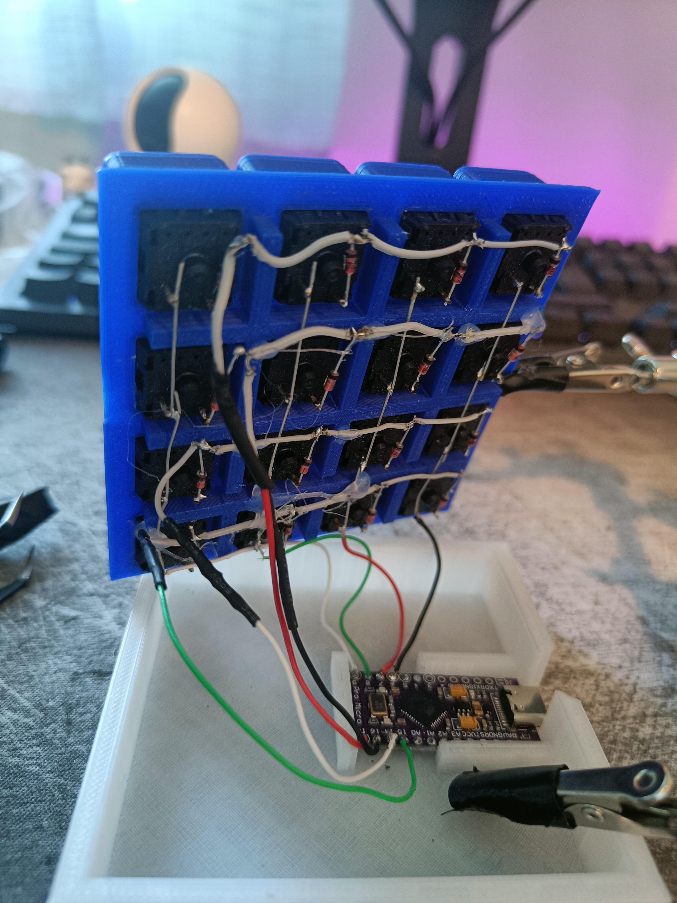

# Arduino Micro macro keyboard
A arduino based keyboard script that works on most Atmega32U4 microcontrollers.

In this case an arduino micro clone was used. The case and buttons were custom designed. If I haven't thrown away the STL's I'll upload them here.

## The front of the keypad

## The the not so beautiful inside of the keypad

Simple diodes were used to create a 4x4 matrix.